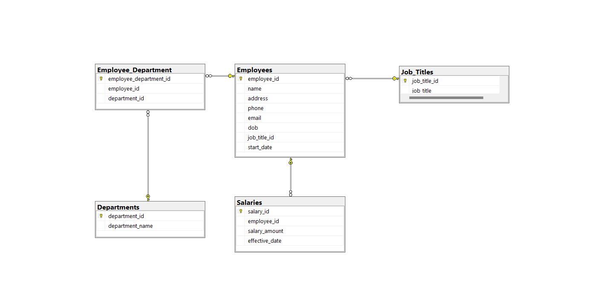

# Faker Data Generation Project

## Project Description
This project uses the Faker Framework to generate fake data for a human resource management system. 
The generated data includes information about "employees, departments, job titles and salaries". 
After Generation is complete, the data will be saved to a CSV file and pushed to a SQL Server database.

## Key Features
- Generate fake data for the tables:
   + Departments
   + Job Titles
   + Employees
   + Salaries
   + Employee Department
- Transfer data from CSV file to SQL Server database.
- Use Power BI to visualize data (updated later)

# That's it, thanks for reading ^^

